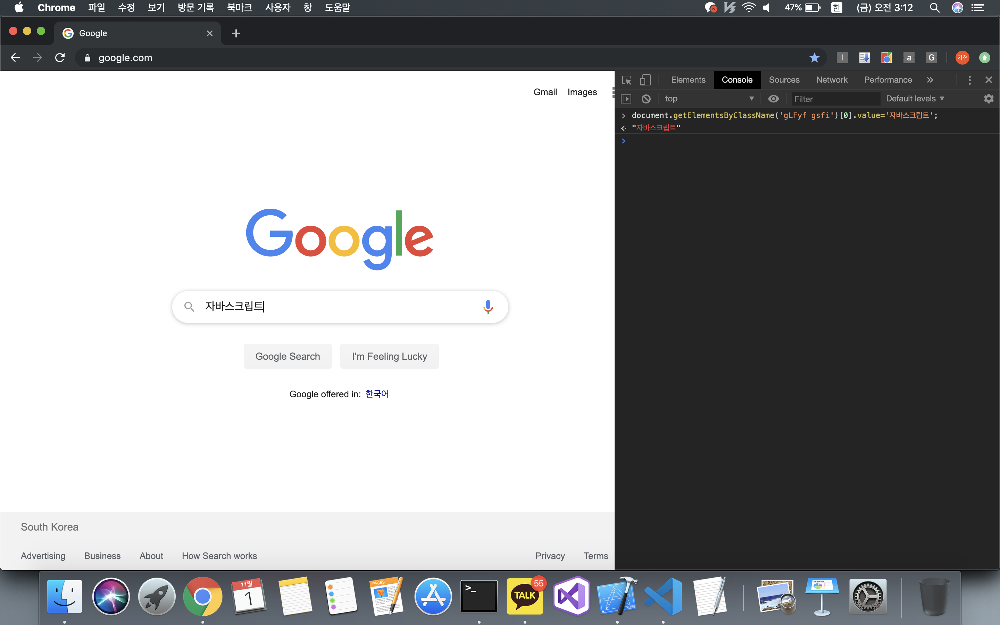
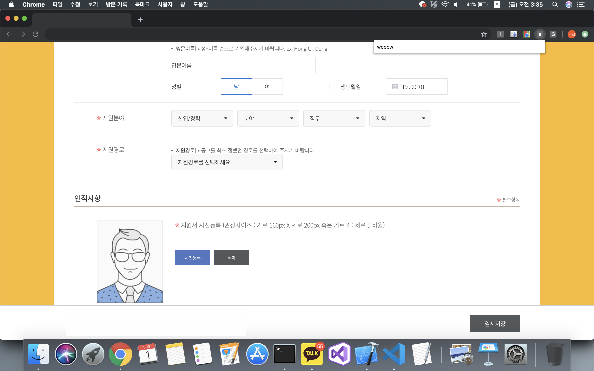

# 이력서 자동완성(ing...)
이력서 작성시 기본 인적사항을 기입하는데 불편함을 느껴 이전에 입력한 데이터를 기반으로 새로 작성하는 이력서의 인적사항을 자동으로 채워주는 기능을 구현하려한다.

### 해결해야할 과제

#### 1. 웹페이지의 채우고자 하는 input 테그를 찾아 html injection 코드를 실행하여 원하는 내용으로 text를 채운다.

- *다음과 같은 내용의 html input 테그가 있다. class 이름을 이용해 input 테그 element를 찾아 값을 대입한다.*
```html
<input class="gLFyf gsfi" maxlength="2048" name="q" type="text" 
jsaction="paste:puy29d" aria-autocomplete="both" aria-haspopup="false" 
autocapitalize="off" autocomplete="off" autocorrect="off" role="combobox" spellcheck="false" 
title="Search" value="" aria-label="Search" data-ved="0ahUKEwikgMzsv8HlAhWQzIsBHbtiD_EQ39UDCAQ">
```
``` js
document.getElementsByClassName('gLFyf gsfi')[0].value='자바스크립트';

```
<p align="center">

</p>


- *input 테그의 required attribute와 id 이용하여 원하는 element에 값을 대입하는 코드이다.*
```js
var x = document.getElementsByTagName("input");
var i;
for(i=0;i<x.length;++i){
  if(x[i].required&&x[i].id=='birthday')
    x[i].value='19990101';
}
```
<p align="center">

</p>


#### 2. input element를 찾는 방법이 너무 구리다. input 테그 앞에 존재하는 label의 text 값으로 원하는 input element를 찾아내자.
